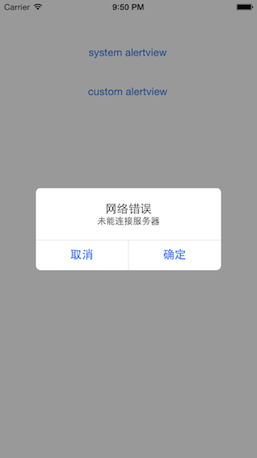

YNAlertView
===========

  

最近不太忙, 看看swift, 写个alertview.

## Usage

```Swift
let alertView = YNAlertView(title: "网络错误", message: "未能连接服务器")
alertView.addButton("取消") {
    println("取消...")
}
alertView.addButton("确定") {
    println("确定...")
}
alertView.show()
```